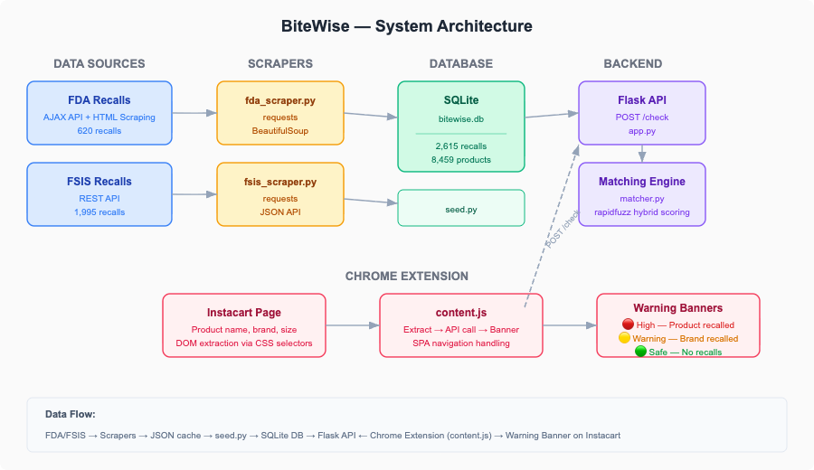
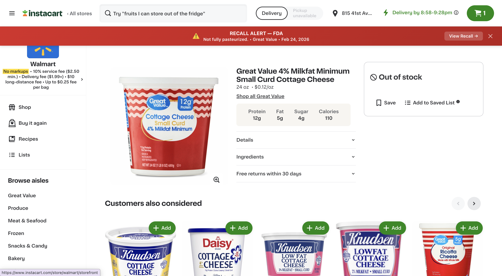
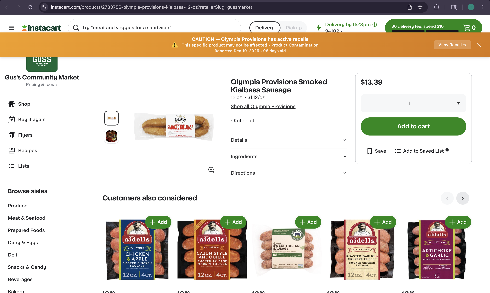
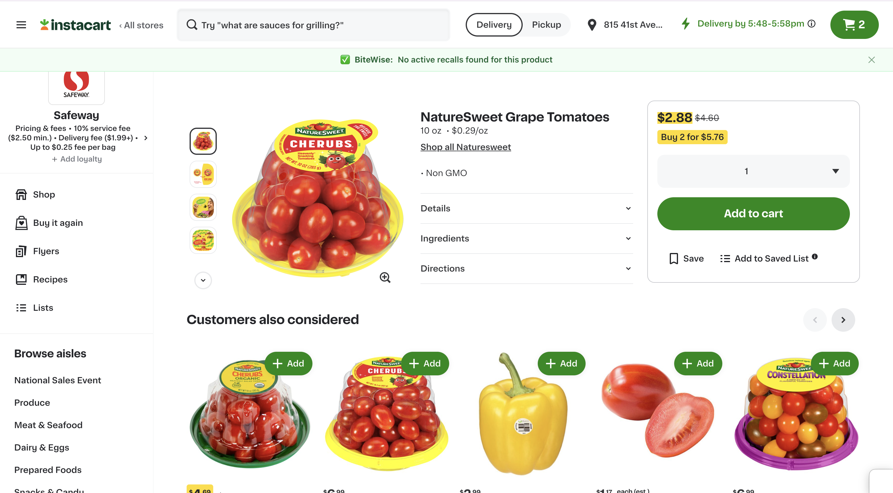

# BiteWise

BiteWise is a full-stack food recall detection tool that helps online grocery shoppers identify potentially recalled products in real time. It combines public recall data from the FDA and USDA FSIS, a local matching API, and a Chrome extension that surfaces warnings directly on Instacart product pages.

This project demonstrates end-to-end product development across data ingestion, normalization, fuzzy matching, backend API design, and browser extension development.

Project showcase:

- GitHub Pages site: [BiteWise Project Page](https://talha-amin123.github.io/BiteWise/)

## Why It Matters

Food recall data is publicly available, but it is fragmented across multiple government sources and is not surfaced where many consumers actually make purchasing decisions. BiteWise closes that gap by bringing recall intelligence to the point of purchase.

## Highlights

- Built a recall ingestion pipeline using FDA web scraping and USDA FSIS API data
- Normalized heterogeneous recall records into a shared SQLite schema
- Designed a hybrid matching engine with fuzzy scoring, token guardrails, size checks, and freshness filtering
- Exposed recall checks through a Flask API
- Developed a Chrome extension that displays live recall status on Instacart product pages
- Added automated tests for matcher behavior and API responses

## Demo

A shopper experience with BiteWise is simple:

1. Extract product details from an Instacart page
2. Query the local Flask API
3. Return one of three user-facing outcomes:
   - High-confidence recall alert
   - Brand-level caution warning
   - No active recall found

Architecture overview:



High-confidence recall alert:



Brand-level caution warning:



No active recalls found:



## System Overview

The application follows a straightforward pipeline:

1. `scrapers/` collects recall data from FDA and FSIS
2. `database/seed.py` loads normalized records into `data/bitewise.db`
3. `api/app.py` exposes a `POST /check` endpoint for product lookup
4. `matching/matcher.py` scores possible recall matches using fuzzy string comparison
5. `extension/content.js` queries the API and injects warnings into Instacart pages

## Tech Stack

- Python
- Flask and Flask-CORS
- SQLite
- Requests and BeautifulSoup
- RapidFuzz
- Chrome Extension (Manifest V3)
- Vanilla JavaScript

## Repository Structure

```text
bitewise/
├── api/
├── data/
├── database/
├── extension/
├── matching/
├── scrapers/
├── screenshots/
├── tests/
├── requirements.txt
└── README.md
```

## Running Locally

### 1. Install dependencies

```bash
python3 -m venv venv
source venv/bin/activate
pip install -r requirements.txt
```

### 2. Collect recall data

```bash
python3 scrapers/fda_scraper.py
python3 scrapers/fsis_scraper.py
```

### 3. Build the database

```bash
python3 database/seed.py
```

### 4. Start the API

```bash
python3 api/app.py
```

The API runs at [http://127.0.0.1:5000](http://127.0.0.1:5000).

### 5. Load the Chrome extension

1. Open `chrome://extensions`
2. Enable Developer mode
3. Click `Load unpacked`
4. Select the `extension/` folder
5. Open an Instacart product page

## Testing

```bash
python3 -m unittest discover -s tests -v
```

The current test suite covers:

- matcher normalization and scoring behavior
- recall classification logic
- API request and response handling

## Example API Request

```bash
curl -X POST http://127.0.0.1:5000/check \
  -H "Content-Type: application/json" \
  -d '{"brand":"rosina","product_name":"Rosina Meatballs, Italian Style","size":"26 oz"}'
```

## Key Engineering Decisions

### Unified data model

FDA and FSIS recalls arrive in different formats. BiteWise normalizes both into a shared relational structure with separate `recalls` and `products` tables to support one-to-many recall relationships.

### Two-stage fuzzy matching

The matcher first checks brand similarity, then product similarity. It also applies extra guardrails such as distinctive token overlap, size compatibility, company-name downweighting, and a 180-day recall freshness window to reduce false positives.

### Freshness filtering

Only active recalls from the last 180 days are surfaced to the user. This keeps alerts relevant and avoids over-warning on stale historical records.

### In-context user experience

Instead of requiring a shopper to search a separate recall database, BiteWise delivers results directly on the product page where the purchase decision happens.

## Limitations

- Instacart selectors may require maintenance if the site changes its DOM structure
- FSIS records often lack strong consumer-facing brand names, which lowers match quality for some meat and poultry recalls
- This is currently a local prototype rather than a continuously deployed production system

## Potential Next Steps

- Add UPC-aware matching
- Improve recall refresh automation
- Expand support beyond Instacart
- Add caching or preloading to reduce per-request database work
- Strengthen frontend styling and accessibility of banners
