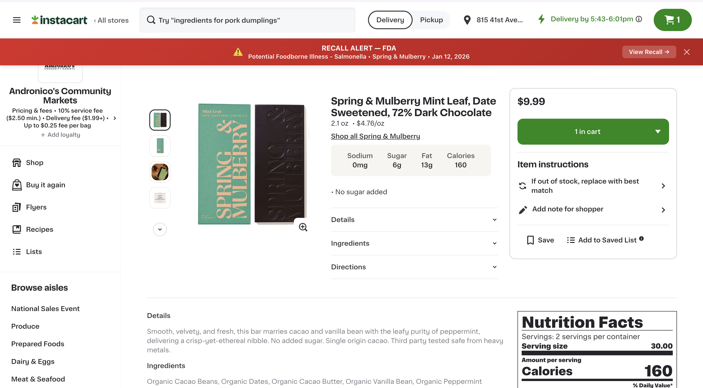

# BiteWise

A food recall safety checker that alerts online grocery shoppers about recalled products in real time. BiteWise aggregates recall data from the FDA and USDA FSIS into a unified database and surfaces warnings via a Chrome browser extension on Instacart product pages.



## Problem

The FDA and FSIS publish food recall notices on separate websites with different formats and structures. Online grocery platforms like Instacart do not surface this information on product pages. BiteWise bridges this gap by connecting government recall data with retail product listings at the point of purchase.

## How It Works


1. **Scrapers** collect recall data from FDA (web scraping) and FSIS (public API)
2. **Seed script** normalizes and loads data into a SQLite database
3. **Flask API** exposes a `/check` endpoint for product matching
4. **Chrome extension** extracts product info from Instacart pages and queries the API
5. **Matching engine** uses hybrid fuzzy scoring to compare products against recall records
6. **Warning banners** appear on the product page based on match confidence

## Project Structure

```
bitewise/
├── scrapers/
│   ├── fda_scraper.py        # FDA recall scraper (AJAX API + detail pages)
│   └── fsis_scraper.py       # FSIS recall scraper (public REST API)
├── database/
│   ├── schema.sql             # SQLite schema (recalls + products tables)
│   └── seed.py                # Populates database from scraped JSON
├── matching/
│   ├── matcher.py             # Hybrid fuzzy matching engine
│   └── debug_match.py         # Debug tool for inspecting match scores
├── api/
│   └── app.py                 # Flask API server
├── extension/
│   ├── manifest.json          # Chrome extension manifest (v3)
│   └── content.js             # Content script (DOM extraction + banners)
├── data/                      # Scraped data and database (gitignored)
│   ├── fda_response.json
│   ├── fda_all_records.json
│   ├── fsis_response.json
│   ├── fsis_all_records.json
│   └── bitewise.db
├── requirements.txt
└── README.md
```

## Setup

### Prerequisites

- Python 3.10+
- Google Chrome or Brave browser

### Installation

```bash
# Clone the repository
git clone https://github.com/your-username/bitewise.git
cd bitewise

# Create virtual environment
python3 -m venv venv
source venv/bin/activate

# Install dependencies
pip install requests beautifulsoup4 rapidfuzz flask flask-cors
```

### Data Collection

```bash
# Create data directory
mkdir -p data

# Run FDA scraper (fetches list + detail pages, ~10 min)
python scrapers/fda_scraper.py

# Run FSIS scraper (single API call, ~5 sec)
python scrapers/fsis_scraper.py
```

### Database Setup

```bash
# Create and populate the database
python database/seed.py
```

Expected output:
```
FDA: 620 recalls, 646 products inserted
FSIS: 1995 recalls, 7813 products inserted
Total recalls: 2615
Total products: 8459
```

### Start the API

```bash
python api/app.py
```

The server runs at `http://127.0.0.1:5000`.

### Install the Chrome Extension

1. Open `chrome://extensions` in your browser
2. Enable **Developer mode** (top right toggle)
3. Click **Load unpacked**
4. Select the `extension/` folder
5. Navigate to any Instacart product page

No registration or fees required — this is local developer mode only.

## Data Sources

| Source | Method | Records | Coverage |
|--------|--------|---------|----------|
| [FDA Recalls](https://www.fda.gov/safety/recalls-market-withdrawals-safety-alerts) | AJAX API + HTML scraping | 620 recalls, 646 products | All food categories |
| [FSIS Recalls](https://www.fsis.usda.gov/recalls) | Public REST API | 1,995 recalls, 7,813 products | Meat, poultry, egg products |

## Database Schema

**Two normalized tables** reflecting the one-to-many relationship between recalls and affected products.

**recalls** — one row per recall event
- `recall_id`, `recall_source`, `recall_announcement_title`, `recall_reason`, `recall_brand_name`, `recall_company_name`, `is_recall_terminated`, `recall_url`, `recall_announcement_date`, `recall_publish_date`, `recall_announcement_html`, `recall_announcement_text`, `recall_risk_level`, `recall_classification`, `recall_number_official`, `recall_states`, `recall_photo_urls`

**products** — one row per product within a recall
- `product_id`, `recall_id` (FK), `product_description`, `product_type`, `raw_detail`

## Matching Engine

The matching engine uses a two-tier approach with hybrid scoring functions.

**Tier 1 — Brand Match** (threshold: 75)
Compares Instacart brand against `recall_brand_name` and `recall_company_name` using a weighted blend:
- `fuzz.ratio` (30%) — strict character similarity
- `fuzz.token_sort_ratio` (30%) — handles word reordering
- `fuzz.partial_ratio` (20%) — substring matching
- Length ratio (20%) — penalizes mismatched string lengths

**Tier 2 — Product Match** (threshold: 60)
Compares product name (with brand stripped) against `product_description`, `raw_detail`, and `recall_announcement_title`:
- `fuzz.token_set_ratio` (40%) — ignores extra words
- `fuzz.token_sort_ratio` (35%) — word order independent
- `fuzz.partial_ratio` (25%) — substring matching

**Classification:**
- **High** (red banner) — brand + product both match
- **Warning** (yellow banner) — brand matches, product doesn't
- **Safe** (green banner) — no matches found

## Extension Screenshots

### Recall Alert (Red Banner)


### Caution Warning (Yellow Banner)


### No Recalls Found (Green Banner)


## API Usage

```bash
# Check a product
curl -X POST http://127.0.0.1:5000/check \
  -H "Content-Type: application/json" \
  -d '{"brand": "rosina", "product_name": "Rosina Meatballs, Italian Style", "size": "26 oz"}'

# Health check
curl http://127.0.0.1:5000/health
```

## Known Limitations

- **FSIS brand names** — FSIS records lack consumer-facing brand names, limiting match accuracy for meat/poultry products
- **Point-in-time snapshot** — scrapers capture current data; no automated scheduled re-scraping
- **Instacart only** — DOM selectors are specific to Instacart; other platforms would need new selectors
- **Generic brand words** — common words in brand names (e.g., "Golden", "Natural") can cause false positives

## Tech Stack

- **Scraping**: Python, Requests, BeautifulSoup
- **Database**: SQLite3
- **Matching**: rapidfuzz
- **API**: Flask, Flask-CORS
- **Extension**: Chrome Manifest V3, vanilla JavaScript

## Team

| Name | Email |
|------|-------|
| Nima Hejazi | nihejazi@ucdavis.edu |
| Saurav Kanegaonkar | svkane@ucdavis.edu |
| Talha Amin | taamin@ucdavis.edu |
| Preksha Raval | pmraval@ucdavis.edu |
| Akansha Totre | aatotre@ucdavis.edu |

UC Davis — MSBA — Data, Design and Representation — March 2026